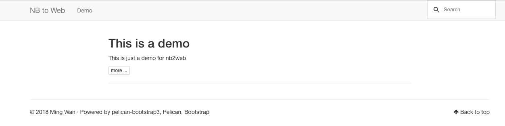

# NB To Web
Convert your juypter notebooks to a website

## ScreenShot


## docker volume

|       volume path       | isRequired | description                                     |
| :---------------------: | ---------- | ----------------------------------------------- |
|  /opt/notebook/content  | Yes        | the notebooks and static resources from jupiter |
|  /opt/notebook/output   | No         | the generated html/css/js from content          |
| /opt/notebook/config.py | No         | the custom config for pelican                   |

## docker env config

| Name                    | default value | description                                                  |
| ----------------------- | ------------- | ------------------------------------------------------------ |
| SITENAME                | NB to Web     | the name of the site                                         |
| SITEURL                 |               | base url of the site                                         |
| AUTHOR                  | Ming Wan      | the author fof the site                                      |
| TIMEZONE                | UTC           | time zone for pelican                                        |
| DEFAULT_LANG            | en            | default lang for pelican                                     |
| DEFAULT_PAGINATION      | False         | default page nation for pelican                              |
| CATEGORIES_CUSTOM_ORDER |               | the custom order for pelican-category-custom-order plugins. split with `,`, e.g. `Get Start, Demo` |
| STATIC_PATHS            |               | the static path in the content, split with `,`, e.g. `img, vedio`              |

you can use /opt/notebook/config.py to set more [settings for pelican](http://docs.getpelican.com/en/stable/settings.html).

# How to use

suppose you have some ipynb like

```
-- notebooks
 +-- img
   +-- demo.png
 +-- getstart_1.ipynb
 +-- getstart_2.ipynb
 +-- demo_1.ipynb
 +-- demo_2.ipynb
```


## Set meta data for your ipynb
### Option 1: Separate MD metadata file

Place the `.ipynb` file in the content folder and create a new file with the
same name as the ipython notebook with extension `.nbdata`.
For example if you have `my_post.ipynb` create a `my_post.nbdata`.

The `.nbdata` should contain the metadata like a regular Markdown based article:

```
Title:
Slug:
Date:
Category:
Tags:
Author:
Summary:

```

Note the empty line at the end, you need that.

You can also specify to only include a subset of notebook cells with the
`Subcells` metadata item.
It should contain the index (starting at 0) of first and last cell to include
(use `None` for "unlimited").
For example, to skip the first two cells:

```
Subcells: [2, None]
```

### Option 2: Metadata cell in notebook

With this option, the metadata is extracted from the first cell of
the notebook (which should be a Markdown cell), this cell is then ignored on the rendering of the notebook.
This avoid the burden of maintaining a separate file or manually editing the
json in the `.ipynb` file like the previous options.

you can put the metadata in the first notebook cell in Markdown mode, like this:

```markdown
- title: My notebook
- author: John Doe
- date: 2018-05-11
- category: pyhton
- tags: pip
```

read more for [pelican-ipynb](https://github.com/danielfrg/pelican-ipynb)

## Run Service with docker

```bash
docker run -v $(pwd)/notebook:/opt/notebook/content -e SITENAME=mysite \
           -e CATEGORIES_CUSTOM_ORDER=GetStart,Demo \
           -e STATIC_PATHS=img \
           -p 8000:8000 \
           uoks/nb_2_web
```

The you can access http://localhost:8000 to get the web site 

## Generate static website with docker

If you just want to generate the static website, you can run

```bash
docker run -v $(pwd)/notebook:/opt/notebook/content \
           -v $(pwd)/output:/opt/notebook/output \
           -e SITENAME=mysite \
           -e CATEGORIES_CUSTOM_ORDER=GetStart,Demo \
           -e STATIC_PATHS=img \
           uoks/nb_2_web make html
```

Then push the `output/` to anywhere, e.g. gitpage

# Power by

* [pelican](https://github.com/getpelican/pelican)
* pelican theme : [pelican-boostrap3](https://github.com/getpelican/pelican-themes/tree/master/pelican-bootstrap3)
* pelican plugins:
    * [i18n_subsites](https://github.com/getpelican/pelican-plugins/tree/master/i18n_subsites)
    * [ipynb](https://github.com/danielfrg/pelican-ipynb)
    * [tipue_search](https://github.com/getpelican/pelican-plugins/tree/master/tipue_search)
    * [category-custom-order](https://github.com/uoks/pelican-category-custom-order)